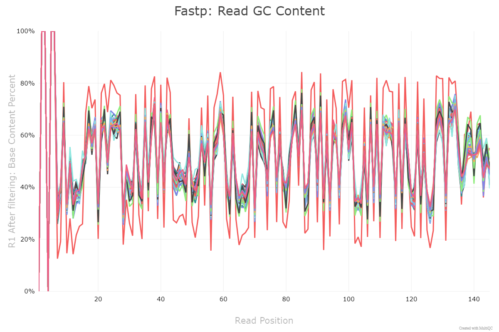

# Multiqc

## Background

The program **multiqc** is used to aggregate separate files from an external programs (in this case **fastp**) into a single report for easy interpretation. We will aggregate the fastp .json file for each individual into a single html file.  \
  \
Multiqc was downloaded from the following link: https://github.com/MultiQC/MultiQC 

### Inputs
1) **json** file from fastp for each individual

## Running multiqc
Fastp files (.json files) were downloaded to my desktop from Compute Canada.  \
  \
In the same folder as the .json files, type the following in the command line:
```
multiqc .
```
### Outputs
Link to the HTML file:  \
[View multiqc HTML file](02_Preprocessing/multiqc_report-fastp.html)  \
  \
Important outputs to consider:
1) GC Content:  \

